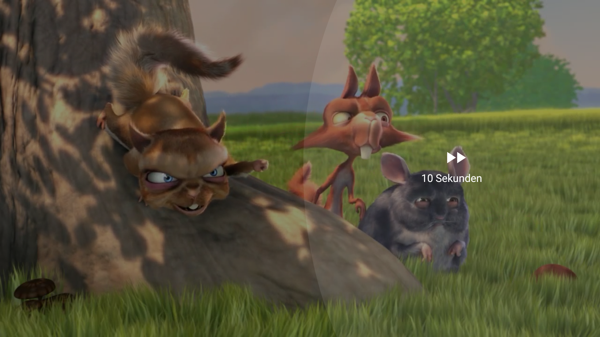

DoubleTapPlayerView
=====

A simple library to include double tap behavior to ExoPlayer's PlayerView. 
Created to handle fast forward/rewind behavior like YouTube.

<p align="center">
    
</p>

# Sample app

If you would like to test the YouTube overlay, then you can either download the demo app,
which can be found under Assets of the release or build it yourself from code. 
It provides all modifications available.

The sample videos own by *Blender Foundation* and a full list can be found [here][videolist].

# Download

The Gradle dependency is available via [jitpack.io][jitpack].
To be able to load this library, you have to add the repository to your project's gradle file:

```gradle
allprojects {
  repositories {
    ...
    maven { url 'https://jitpack.io' }
  }
}
```

Then, in your app's directory, you can include it the same way like other libraries:

```gradle
dependencies {
  implementation 'com.github.vkay94:DoubleTapPlayerView:0.7.1'
}
```

The minimum API level supported by this library is API 21 (Lollipop 5.0+).


# Getting started

In order to start using the YouTube overlay, the easiest way is to include it directly 
into your XML layout, e.g. on top of `DoubleTapPlayerView` or inside ExoPlayer's controller: 

```xml
<FrameLayout
    xmlns:android="http://schemas.android.com/apk/res/android"
    xmlns:app="http://schemas.android.com/apk/res-auto"
    android:layout_width="match_parent"
    android:layout_height="match_parent" >
    
    <com.github.vkay94.dtpv.DoubleTapPlayerView
        android:id="@+id/playerView"
        android:layout_width="match_parent"
        android:layout_height="match_parent" />

    <com.github.vkay94.dtpv.youtube.YouTubeOverlay
        android:id="@+id/youtube_overlay"
        android:layout_width="match_parent"
        android:layout_height="match_parent"
        android:visibility="gone"
        
        app:yt_playerview="@+id/playerView" />
</FrameLayout>
```

Then, inside your `Activity` or `Fragment`, you can specify which preparations should be done
before and after the animation, but at least, you have got to toggle the visibility of the overlay
and reference the (Simple)ExoPlayer to it:

```kotlin
youtube_overlay.apply {
    performListener = object : YouTubeOverlay.PerformListener {
        override fun onAnimationStart() {
            // Do UI changes when circle scaling animation starts (e.g. hide controller views)
            youtube_overlay.visibility = View.VISIBLE
        }

        override fun onAnimationEnd() {
            // Do UI changes when circle scaling animation starts (e.g. show controller views)
            youtube_overlay.visibility = View.GONE
        }
    }
}  

// Call this method whenever the player is released and recreated
youtube_overlay.setPlayer(simpleExoPlayer)
```

This way, you have more control about the appearance, for example you could apply a fading animation to it.

---

# API documentation

The following sections provide detailed documentation for the components of the library.

## DoubleTapPlayerView

`DoubleTapPlayerView` is the core of this library. It recognizes specific gestures 
which provides more control for the double tapping gesture.
An overview about the added methods can be found in the [PlayerDoubleTapListener][PlayerDoubleTapListener] interface.

You can adjust how long the double tap mode remains after the last action,
the default value is 650 milliseconds.

## YouTubeOverlay

`YouTubeOverlay` is the reason for this library. It provides nearly the
same experience like the fast forward/rewind feature which is used by YouTube's
Android app. It is highly modifiable.

### XML attributes

If you add the view to your XML layout you can set some custom attributes 
to customize the view's look and behavior. 
Every attributes value can also be get and set programmatically.


| Attribute name | Description | Type |
| ------------- | ------------| ------|
| `yt_ffrDuration` | Fast forward/rewind duration skip per tap. The text *xx seconds* will also be changed where xx is `value/1000`. | `int` |
| `yt_animationDuration` |  Speed of the circle scaling / time to expand completely. When this time has passed, YouTubeOverlay's `PerformListener.onAnimationEnd()` will be called. | `int` |
| `yt_arcSize` | Arc of the background circle. The higher the value the more roundish the shape becomes. | `dimen` | 
| `yt_tapCircleColor` | Color of the scaling circle after tap. | `color` |
| `yt_backgroundCircleColor` | Color of the background shape. | `color` |

### YouTubeOverlay.PerformListener

This interface listens to the *lifecycle* of the overlay.

**onAnimationStart()** *(obligatory)*

Called when the overlay is not visible and the first valid double tap event occurred.
Visibility of the overlay should be set to VISIBLE within this interface method.

**onAnimationEnd()** *(obligatory)*

Called when the circle animation is finished.
Visibility of the overlay should be set to GONE within this interface method.

### SeekListener

This interface reacts to the events during rewinding/forwarding. 

`onVideoStartReached()` is called when the start of the video is reached and
`onVideoEndReached()` is called when the end of the video is reached.

[videolist]: https://gist.github.com/jsturgis/3b19447b304616f18657
[demoapp]: https://
[jitpack]: https://jitpack.io/#vkay94/DoubleTapPlayerView
[PlayerDoubleTapListener]: https://github.com/vkay94/DoubleTapPlayerView/blob/master/doubletapplayerview/src/main/java/com/github/vkay94/dtpv/PlayerDoubleTapListener.java
[MainActivity]: https://github.com/vkay94/DoubleTapPlayerView/blob/master/app/src/main/java/com/github/vkay94/doubletapplayerviewexample/MainActivity.kt
[VideoActivity]: https://github.com/vkay94/DoubleTapPlayerView/blob/dev/app/src/main/java/com/github/vkay94/doubletapplayerviewexample/VideoActivity.kt
